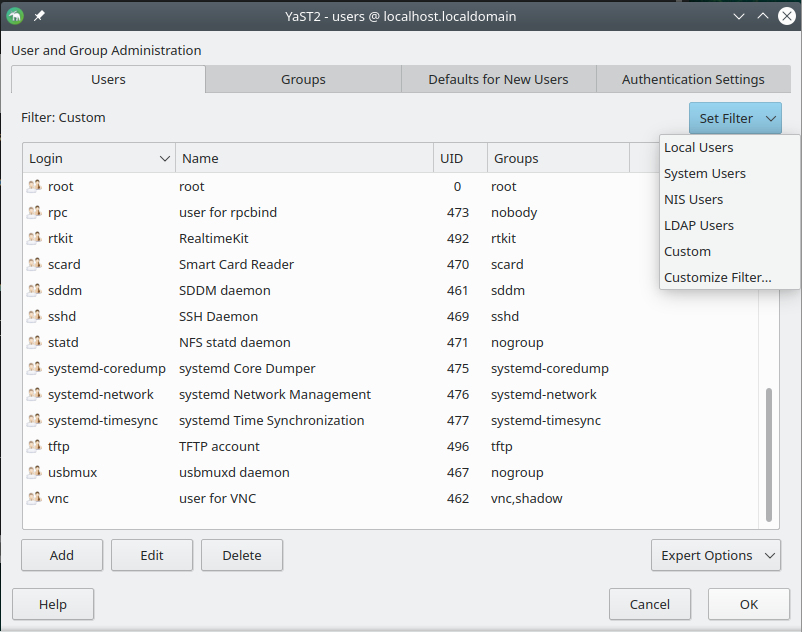
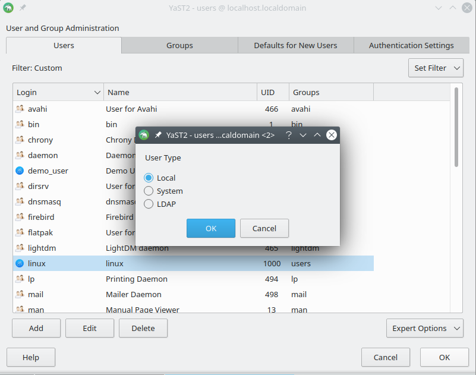
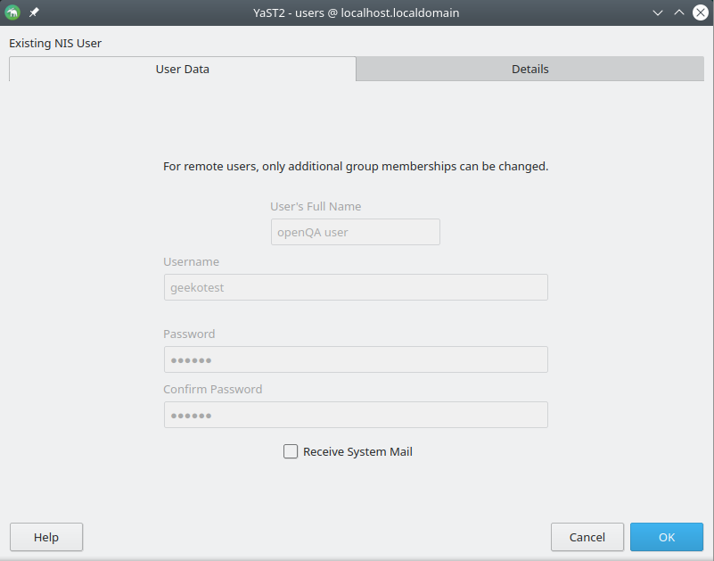
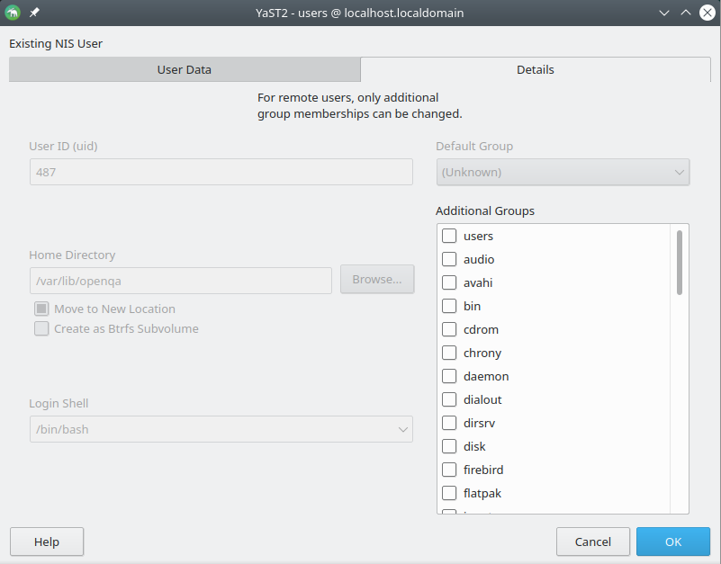
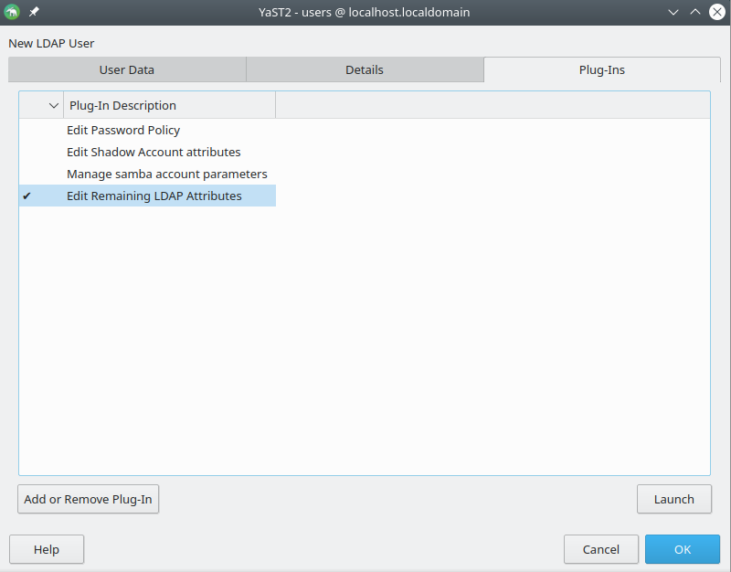
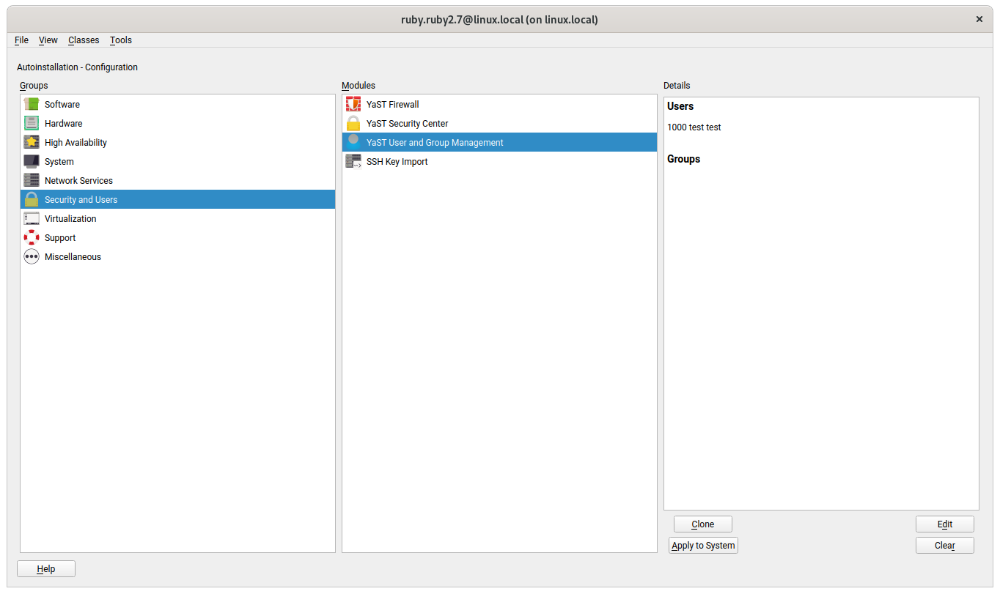
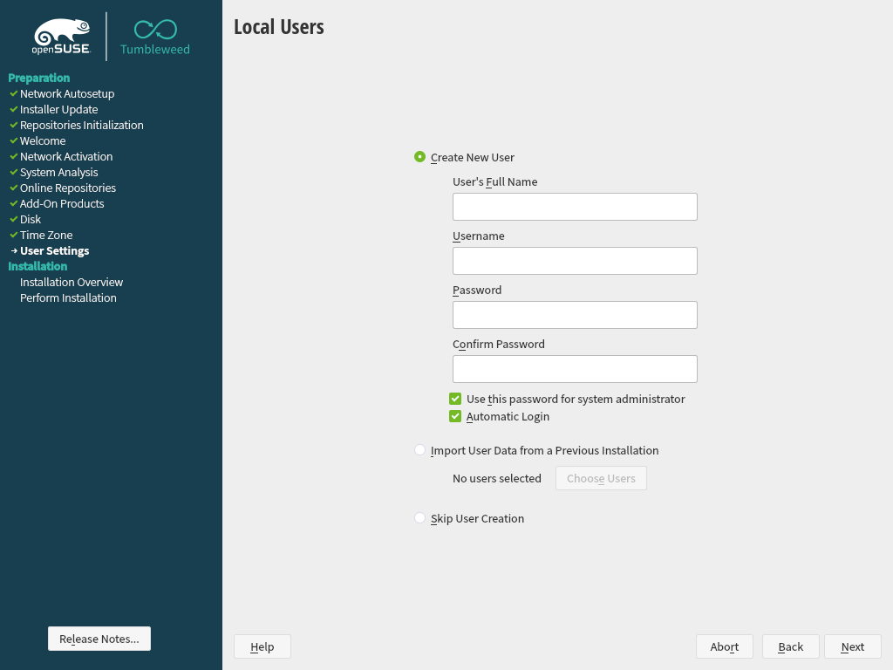
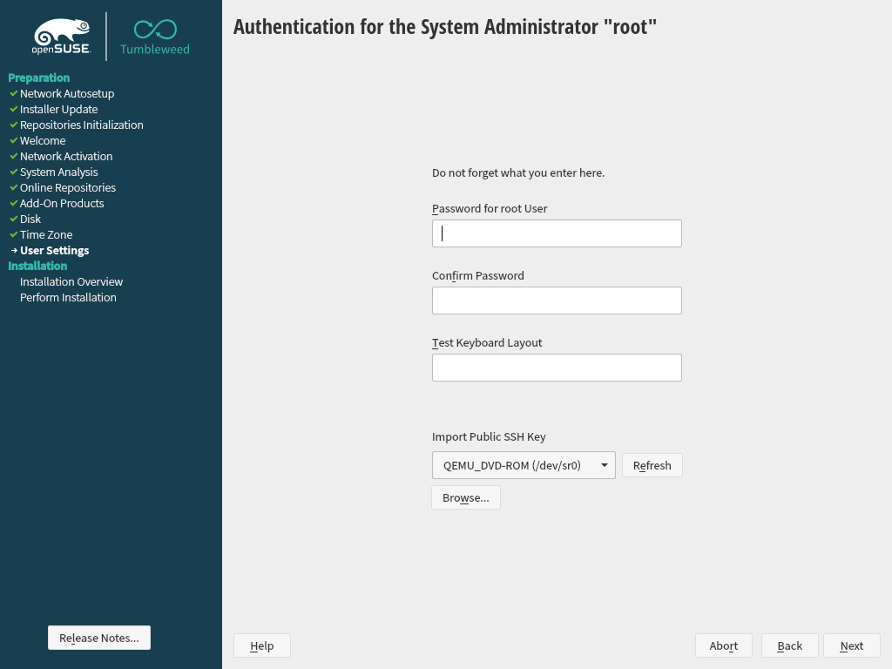

# Use-cases of the Old YaST Users Module

This document is intended to describe the use-cases of the old YaST Users module.

Disclaimer: Everything described here is the result of playing with the module's UI. It is not based on any official requirements. Some customer's use-cases could be overlooked.

## YaST Users UI

The UI of the YaST Users module consists on a dialog with 4 tabs: *Users*, *Groups*, *Defaults* for *New Users* and *Authentication Settings*.

The *Users* and *Groups* tabs contain an *Expert Options* menu button. Let's start describing each tab and then we will take care of the expert options.

### Tab "Users"

* Lists the users
* Allows to manage four kinds of users:
    * Normal local users (1000 <= UID <= 60000)
    * System local users (100 <= UID <= 499)
    * NIS users
    * LDAP users
* A filter allows to select the type of users to display:
    * Normal users only
    * System users only
    * NIS users only (visible only if the system is configured to get users via NIS)
    * LDAP users only (may ask for LDAP authentication if not provided before)
    * Or several types at the same time (custom search)
* Allows to add, edit and delete users

Note: normal users have UID in the range 1000 - 60000, and system users are in the range 100 - 499. These values are configured in */etc/login.defs*.

Obviously, to manage LDAP users and groups is necessary to connect to an LDAP directory. The
settings for such connection are read from */etc/openldap/ldap.conf*. On the first access to the
LDAP server (for example, when selecting "LDAP Users" in the mentioned filter) YaST asks for the
BindDN and password, allowing also to select "anonymous access" instead.

The forms for adding a new user or to edit an existing one depend on the type of user. When adding
a new user, the type is chosen based on the current filter. For example, if the filter is set to
"system users", then a system user would be added. In case the filter is customized to show several
types of users, then a popup is shown in order to select the type of user to create.

#### Managing local users

The dialog for a local user contains 5 tabs: *User Data*, *Details*, *Password Settings*, *SSH
Public Keys* and *Plug-Ins*. For a system user, the form only contains *User Data*, *Details* and
*Password Settings*.

* User Data
    * Full name
    * Username
    * Password
    * Confirm password
    * Receive system mail
    * Disable user login
* Details
    * User ID
    * Home directory
    * Home directory permissions Mode
    * Empty home (whether to use skel or not)
    * Create as Btrfs subvolume
    * Additional user information
    * Login shell
    * Default group
    * Additional groups
* Password Settings
    * Force password change
    * Days before password expiration to issue warning
    * Days after password expires with usable login
    * Maximum number of days for the same password
    * Minimum number of days for the same password
    * Expiration date
* SSH Public Keys (authorized keys)
    * Allows to add/remove keys
* Plug-Ins
    * Allows to add/remove plugins
    * Allows to launch plugins (e.g., for managing user quota)
    * Observations:
        * This looks like overwhelming

#### Managing NIS users

The management of NIS users is of course limited to modifying a few properties, as shown in
the following screenshots.

If a system is configured as a NIS server and as its own NIS client, then all the users from the system can be listed as local/system users and as NIS users too. For example, let's say there is a local user *John*, which is listed when the list filter is set to *Local Users*. If you edit that user, the form will contain the options for a local user as explained above. But *John* is also listed when the filter is set to *NIS Users*. In that case, *John* is considered as a NIS user, so the NIS form will be shown when you edit that user.

#### Managing LDAP users

The forms for adding and editing LDAP users contain fewer tabs than the equivalent ones for local
users because most of the LDAP properties are managed through plug-ins. The list of plug-ins varies
based on the installed YaST packages (eg. the plug-in to modify the Samba-related attributes of the
user is part of the yast2-samba-server package) and the configuration of the system (eg. the
Kerberos or Samba plug-ins are listed only if the system seems to be part of a Kerberos and/or Samba
infrastructure).

### Tab "Groups"

* Lists the groups
* Allows to manage four kinds of groups:
    * Normal local groups
    * System local groups
    * NIS groups
    * LDAP groups
* A filter makes it possible to select the type of groups to display, with a mechanism equivalent
  to the one described for users
* Allows to add, edit and delete groups

As described for the management of users, the form for adding or editing a group depends on the
type of group, and the type of a new group depends on the current filter.

#### Managing local groups

The dialog for a local group contains 2 tabs: *Group Data* and *Plug-Ins*. For a system group, the form only contains the *Group Data* fields.

* Group Data
    * Group name
    * Group ID
    * Password
    * Confirm password
    * Group members

* Plug-Ins
    * Allows to add/remove plugins
    * Allows to launch plugins (e.g., for managing group quota)
    * Observations:
        * This looks like overwhelming

### Tab "Defaults for New Users"

This tab allows to configure the default settings for creating a new user. Basically, it allows to edit the options of */etc/default/useradd* config file.

* Default group
* Secondary groups
* Default login shell
* Path prefix for home directory
* Skeleton for home directory
* Umask for home directory
* Default expiration date
* Days after password expiration login is usable

### Tab "Authentication Settings"

This tab is intended to show all modules that could affect sources of user accounts of authentication type, e.g., NIS, SSSD, Samba. The clients to configure these services can be launched from this tab. More research needed about the possibilities of each service.

### Tab "Expert Options"

There is an Expert Options select button with these options:

* Password Encryption
    * Allows to select: DES, MD5, SHA-256, SHA-512
    * This option is used to select the encryption algorithm when adding a new user
    * Observations:
        * No way to specify an encryption algorithm for a specific user in the dialog for adding a  user
        * No way to see the encryption algorithm used for a user
* Write changes now
    * Applies changes without closing the client
* LDAP search filter
    * Allows more fine grained search for LDAP users or groups
    * Allows to select attributes (e.g., objectClass, memberUid, etc) and a value for the attribute
    * Observations:
        * Looks like too complex, only for LDAP experts
        * Seems to be misplaced because there is a filter button where to set criteria to filter users and groups.
* LDAP User and Group Configuration
    * Allows to indicate whether to create a home directory in the machine for the LDAP users.
    * Allows to configure Password Policies for LDAP
    * Observations:
        * Looks like too complex, only for LDAP experts

## AutoYaST

*yast2-users* provides AutoYaST support and it allows: to create users during auto-installation, to export the list of user from the current system into a profile, and to use the AutoYaST UI in order to configure the users section of the profile.

### Auto-installation (Import)

*yast2-users* provides AutoYaST support for creating users and groups locally. But remote users and groups (e.g., NIS, LDAP, etc) are not supported. Note that AutoYaST allows to configure a target system as a NIS server/client. That functionality is provided by *yast2-nis-server* and *yast2-nis-client* respectively, but the NIS configuration does not affect to the users support in AutoYaST.

The AutoYaST profile admits the following settings for the *<user>* section:

* username
* fullname
* forename
* surname
* uid
* gid
* home
* home_btrfs_subvolume
* shell
* user_password
* encrypted
* password_settings
* authorized_keys

Moreover, it allows to define the defaults for the new users:

* group
* groups
* home
* expire
* inactive
* no_groups
* shell
* skel
* umask

AutoYaST will use that defaults for a new user and it will write those settings to */etc/default/useradd* file.

For groups, the following settings are supported:

* groupname
* gid
* group_password
* encrypted
* userlist

And finally, these two special settings can be enabled in *<login_settings>* section:

* autologin_user
* password_less_login

For more details and for the specific meaning of each setting, see [AutoYaST Users and Groups documentation](https://documentation.suse.com/sles/15-SP2/html/SLES-all/cha-configuration-installation-options.html#Configuration-Security-users-and-groups).

### Cloning System (Export)

When cloning the configuration from the current system (*yast2 clone_system*), all the local/system users and groups are exported to the *xml* profile. By default, all the users and groups will be exported, but you can filter the system users/groups out by passing the *target* option. For example, *yast2 clone_system modules target=compact* will export only the local users and groups.

Note that only users and groups from the system (i.e., */etc/passwd* and */etc/groups*) are exported, so no LDAP, NIS o SAMBA users are taken into account.

### Configuring profile (AutoYaST UI)

*yast2-users* also provides support for the AutoYaST UI (namely, *yast2 autoyast ui*) in order to configure a xml profile. The AutoYaST UI shows an *Users and Groups Management* section. In that section there is a *Clone* button which can be used to clone (i.e., to export) all the users and groups. But you can also "edit" users. When using the *Edit* button, the very same UI as *yast2 users* is open, but limiting it to local/system users. Again, no NIS, LDAP, etc. Only edited or added users/groups will be exported.

## Installation and Firstboot

*yast2-users* offers an installation client in order to create local users in the target system. Such a client opens a dialog with three options: *Create New User*, *Import User Data From a Previous Installation* and *Skip User Creation*. The first option allows to create a new user by indicating a name, username, password, etc. Alternatively, users can be imported from a previous installation with the *Import User Data* option. The *Skip User Creation* option can be used in case that no specific local user is needed.

If the password for the system administrator cannot be inferred from the user selection (i.e., *Use this password for system administrator* was not selected), then a second client is provided in order to configure the root user.

Note: currently, the installation summary shows nothing about the users. You would need to go back to the users step in order to modify your selection.

*yast-firstboot* also provides clients to create a local user and to configure root. Those firstboot clients are simply wrappers on the *yast2-users* clients.

## Command Line

*yast2-users* provides a command line interface for users and groups:

~~~
linux:~ # yast2 users help

YaST Configuration Module users
-------------------------------

User configuration module

Basic Syntax:
    yast2 users interactive
    yast2 users <command> [verbose] [options]
    yast2 users help
    yast2 users longhelp
    yast2 users xmlhelp
    yast2 users <command> help

Commands:
    add     Add new user
    delete  Delete an existing user (home directory is not removed)
    edit    Edit an existing user
    list    List of available users
    show    Show information of selected user

Run 'yast2 users <command> help' for a list of available options.
~~~

~~~
linux:~ # yast2 groups help

YaST Configuration Module groups
--------------------------------

Group configuration module

Basic Syntax:
    yast2 groups interactive
    yast2 groups <command> [verbose] [options]
    yast2 groups help
    yast2 groups longhelp
    yast2 groups xmlhelp
    yast2 groups <command> help

Commands:
    add     Add new group
    delete  Delete an existing group
    edit    Edit an existing group
    list    List of available groups
    show    Show information of selected group

Run 'yast2 groups <command> help' for a list of available options.
~~~

Users and groups can be added, edited, deleted, listed and shown. Moreover, it offers an *interactive* move to run commands:

~~~
linux:~ # yast2 users interactive
YaST2 users> list
ivan
test
YaST2 users> show username=test
Full Name:
        test
List of Groups:

Default Group:
        users
Home Directory:
        /home/test
Login Shell:
        /bin/bash
Login Name:
        test
UID:
        1001
YaST2 users>
~~~
